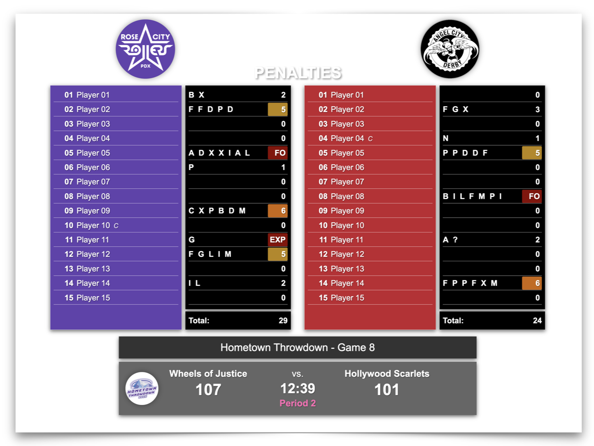

# Penalties Overlay

## Contents

- [Features](#features "Overlay Features")
- [Compatibility](#compatibility "Overlay CRG Compatibility")
- [Usage](#usage "Overlay Usage Instructions")
- [Configuration](#configuration "Configuration File Reference")

## Preview

## Overview

Video streaming teams often display an overlay with penalty data during timeouts, although it isn't always easy for viewers to understand what all of the data means.  This is especially true when a penalty overlay might only be visible for a few seconds.  The intent of this overlay is to provide a simple view of penalty and game status information in a format that makes it easy to see:

- Which teams are playing each other.
- The score, period number, and game clock.
- Which team is on which side of the screen.
- Which players have penalties, and how many they have.
- Which players have high penalty counts, have fouled out, or have been expelled/removed.
- How many penalties each team has.
- Tournament information, if applicable.
- The status of any active timeout.
- Optionally, the host league, tournament, or sanctioning body's logo.

## Features

The overlay gets the information and settings it needs from CRG, so you can just set up your game(s) and expect the overlay to work.  The overlay displays information from CRG in two separate areas: one for rosters and penalties, and one for game information.

### Rosters & Penalties Area

- Displays team logos.
  - Logos automatically resize to fit 100px x 100px containers.
- Displays rosters for each team that include player numbers, names, assigned penalty codes, and total penalty count for each player.
  - Indicates team captains with a "C" and alternate captains with an "A".
  - Hides roster names that:
    - Are marked as "Not Skating", "Bench Alt Captain", or "Bench Staff".
  - Uses each team's custom "whiteboard" background, text, and glow colors if set.
    - Defaults to black backgrounds with white text if not set.
- Highlights player penalty counts with different color backgrounds at specific thresholds.
  - 5 penalties in yellow :yellow_square:
  - 6 penalties in orange :orange_square:
  - 7+ penalties, foul outs, expulsions, and removals in red :red_square:
- Changes player numeric penalty counts to:
  - "FO" for foul outs.
  - "EXP" for expulsions.
  - "RE" for head official removals.
- Displays the total count of penalties for each team.

### Game Information Area

- Displays the tournament name if set.
  - Displays the game number if it and the tournament name are set.
- Displays team names if set.
  - Uses the "whiteboard" alternate name text for each team if set.
  - Uses the "Team" fields in the "Teams" tab for a game if the "whiteboard" name is not set.
  - Defaults to "Team 1" and "Team 2" if neither the "whiteboard" nor "Team" names are set.
- Displays each team's score.
- Displays the game clock.
- Displays a game status label:
  - Uses the appropriate label set by clicking the "Intermission Labels" button section on CRG's "Settings" page:
    - **Pre Game** - defaults to "Time to Derby".
    - **Intermission** - defaults to "Intermission".
    - **Unofficial Score** - defaults to "Unofficial Score".
    - **Official Score** - defaults to "Official Score".
    - **Official Score with Clock** - defaults to "Official Score".
  - Uses default game clock labels for other game statuses:
    - "Period N" - during each period.
    - "Overtime" - during overtime jams.
- Displays a timeout banner to indicate the type of timeout.
- Optionally displays a custom logo to provide league, tournament, or sanctioning body branding.
  - Automatically resized to fit a 70px x 70px container.

## Compatibility

| CRG Version | Description        |
| ----------- | -------------------|
| 2025.x      | :white_check_mark: |
| 2023.x      | Not Tested         |
| Other       | :x:                |

## Usage

To make this overlay available to your video streaming team, you need to download the overlay files from this repository and place them in a specific folder within your instance of CRG.  There are several ways to download the overlay files, and the following steps detail one method.

**Download the overlay files:**

1. Navigate to the [Releases page](https://github.com/rcrderby/crg-overlays/releases "Releases Page") of this repository.
2. Click on one of the **Source code** links in the **Assets** section of the latest release to download a compressed/zipped copy of the overlay files.
3. Extract the `.zip` or `tar.gz` file you downloaded.
4. From the extracted files, locate the `penalties` folder; you will copy this folder to your instance of CRG.

**Copy the overlay files to CRG:**

1. Open the folder on your scoreboard computer that contains your instance of CRG (e.g., `crg-scoreboard_v202N.x`).
2. Open the `html` folder.
3. Open the `custom` folder.
4. Open the `overlay` folder.
5. Copy and paste or move the `penalties` folder you downloaded into the `overlay` folder.

**Verify the availability of the penalties overlay:**

1. Access your running instance of CRG using your web browser (`https://<crg-ip-address>:8000`).[^1]
2. In the **BROADCAST OVERLAYS** section on the left side of the main page, click the **Custom Overlays** link.
3. From the displayed list of files and directories, click the **penalties** link to display the overlay.

### Open Broadcaster Software (OBS) Details

Provide this information to your video streaming team to give them access to the overlay:

| Setting    | Value                                                         |
| ---------- | ------------------------------------------------------------- |
| URL        | `https://<crg-ip-address>:8000/custom/overlay/penalties/`[^1] |
| Width      | `1920`                                                        |
| Height     | `1080`                                                        |
| Control audio via OBS | Unchecked                                          |
| Use custom frame rate | Unchecked                                          |
| Custom CSS | Blank                                                         |
| Shutdown source when not visible | Unchecked                               |
| Refresh browser when scene becomes active | Unchecked                      |
| Page permissions | `Read access to OBS status information`                 |

### Optional Custom Logo

To add a custom logo to the left side game information area of the overlay:

1. Create a logo file with the name `banner-logo.png`.[^2]
2. Open the folder on your scoreboard computer that contains your instance of CRG (e.g., `crg-scoreboard_v202N.x`).
3. Open the `html` folder.
4. Open the `custom` folder.
5. Open the `overlay` folder.
6. Open the `logos` folder.
7. Copy and paste or move the `banner-logo.png` file into the `logos` folder.

The logo will display in the game information area of the overlay once you refresh your browser.

## Configuration

A configuration file named [config.js](./config.js) allows you to customize various overlay settings.  Please note that some settings are safe to change, and others are best left at their default values:

- :white_check_mark: - Safe to change
- :warning: - Proceed with caution
- :x: - Not Recommended

### Common Customizations

- `config.overlayScale` to adjust the overlay size - typically between 80% and 120% (default is `100`).
- `config.titleBannerText` to adjust the title banner text (default is `PENALTIES`).
- `config.titleBannerBackgroundColor` and `titleBannerForegroundColor` set the title banner box background and text colors respectively.

  

    Configuration File Reference
  

> [!NOTE]
> Changes to `config.js` require a page refresh to take effect.

  ***debug*** **Section**

  | Setting | Description | Type | Default | Adjustable |
  | - | - | - | - | - |
  | `debug` | Enable debug logging to browser console (set to `true` for troubleshooting) | boolean | `false` | :white_check_mark: |

  ---

  ***config*** **Section**

  | Setting | Description | Type | Default | Adjustable |
  | - | - | - | - | - |
  | `bannerLogoPath` | Path to an optional custom logo in the game information section | string | `logos/banner-logo.png` | :warning: |
  | `filteredSkaterFlags` | Skater flags to filter from roster display (Not Skating, Bench Alt Captain, Bench Staff) | array of strings | `['ALT', 'B', 'BA']` | :x: |
  | `defaultRosterShadowProperties` | Default roster shadow properties | string | `.5px .5px 1px` | :x: |
  | `loadingOverlayText` | Text displayed on the "loading" screen | string | `Loading game data...` | :white_check_mark: |
  | `titleBannerBackgroundColor` | Title banner background color hex value, color name, or `transparent` | string | `#666666`[^3] | :white_check_mark: |
  | `titleBannerForegroundColor` | Title banner text/foreground color hex value, color name, or `transparent` | string | `#ffffff`[^3] | :white_check_mark: |
  | `titleBannerShadow` | Title banner box shadow visibility | boolean | `true` | :white_check_mark: |
  | `penaltiesTitleText` | Title banner text | string | `PENALTIES` | :white_check_mark: |
  | `overlayScale` | Overlay scale size - percentage: 100 = full size, 90 = 90% size, etc. (1% to 200%) | integer | `100` | :white_check_mark: |

  ---

  ***classes*** **Section**

  | Setting | Description | Type | Default | Adjustable |
  | - | - | - | - | - |
  | `customLogoSelector` | CSS Selector for the custom logo container | string | `#custom-logo` | :x: |
  | `customLogoSpaceSelector` | CSS Selector for the custom logo space container | string | `#custom-logo-space` | :x: |
  | `customLogoSpaceVisibleSelectorSuffix` | CSS Selector for the visible custom logo space container container | string | `visible` | :x: |
  | `loadingOverlayFadeOutSuffixSelector` | CSS Selector for the loading overlay fade out | string | `fade-out` | :x: |
  | `loadingOverlaySelector` | CSS Selector for the loading overlay | string | `#loading-overlay` | :x: |
  | `loadingOverlayTextSelector` | CSS Selector for the loading overlay text | string | `.loading-text` | :x: |
  | `penaltiesTitleH1Selector` | CSS Selector for the penalties title H1 text | string | `#penalties-title h1` | :x: |
  | `teamsScoresHasLogoSelectorSuffix` | CSS Selector for the team scores custom logo padding container | string | `has-logo` | :x: |
  | `teamsScoresSelector` | CSS Selector for the team scores container | string | `#teams-scores` | :x: |
  | `textShadow` | CSS Variable for text shadows | string | `var(--team-penalties-default-text-shadow)` | :x: |

  ---

  ***labels*** **Section**

  | Setting | Description | Type | Default | Adjustable |
  | - | - | - | - | - |
  | `altCaptainFlag` | Character displayed next to alternate captain names | string | `A` | :warning: |
  | `captainFlag` | Character displayed next to team captain names | string | `C` | :warning: |
  | `defaultTeamNamePrefix` | Prefix used for default team names | string | `Team` | :warning: |
  | `defaultPeriodLabelPrefix` | Prefix used for default period label | string | `Period` | :warning: |
  | `expelledDisplay` | Text displayed for expelled skaters | string | `EXP` | :warning: |
  | `fouloutDisplay` | Text displayed for fouled out skaters | string | `FO` | :warning: |
  | `preFirstPeriodLabel` | Label shown before P1 when IGRF start time is missing or in the past | string | `Period 1` | :warning: |
  | `removedDisplay` | Text displayed for removed skaters | string | `RE` | :warning: |
  | `timeout.untyped` | Label for untyped timeout | string | `Timeout` | :white_check_mark: |
  | `timeout.official` | Label for official timeout | string | `Official Timeout` | :white_check_mark: |
  | `timeout.team` | Label for team timeout | string | `Team Timeout` | :white_check_mark: |
  | `timeout.review` | Label for official review | string | `Official Review` | :white_check_mark: |
  | `timeoutOwner.official` | Timeout owner indicator for official | string | `O` | :x: |
  | `timeoutOwner.team1` | Timeout owner indicator for team 1 | string | `_1` | :x: |
  | `timeoutOwner.team2` | Timeout owner indicator for team 2 | string | `_2` | :x: |

  ---

  ***rules*** **Section**

  | Setting | Description | Type | Default | Adjustable |
  | - | - | - | - | - |
  | `fouloutPenaltyCount` | Number of penalties that result in a foulout | integer | `7` | :x: |
  | `numPeriods` | Override a custom number of periods | integer | `2` | :x: |
  | `numTeams` | Override a custom number of teams | integer | `2` | :x: |
  | `warningPenaltyCount5` | Penalty count that triggers the first warning color | integer | `5` | :warning: |
  | `warningPenaltyCount6` | Penalty count that triggers second warning color | integer | `6` | :warning: |

  ---

  ***penalties*** **Section**

  | Setting | Description | Type | Default | Adjustable |
  | - | - | - | - | - |
  | `fouloutCode` | Penalty codes for fouled out players | string | `FO` | :x: |
  | `removedCode` | Penalty code for players removed by the head referee | string | `RE` | :x: |

  ---

  ***timing*** **Section**

  | Setting | Description | Type | Default | Adjustable |
  | - | - | - | - | - |
  | `initWebSocket` | Delay before initializing display after WebSocket connects (ms) | integer | `100` | :x: |
  | `minLoadDisplayMs` | Minimum time to show loading screen (ms) | integer | `500` | :x: |

<!-- Footnotes -->

[^1]: Replace `<crg-ip-address>` with the IP address of your CRG instance.
[^2]: The overlay will constrain your logo to a 70px x 70px container and apply a drop shadow.  
Logos with a 1:1 aspect ratio and a transparent background will produce the best appearance.
[^3]: See the [Mozilla Color Reference Documentation](https://developer.mozilla.org/en-US/docs/Web/CSS/Reference/Values/named-color#value "Mozilla Color Reference Documentation") for value examples.