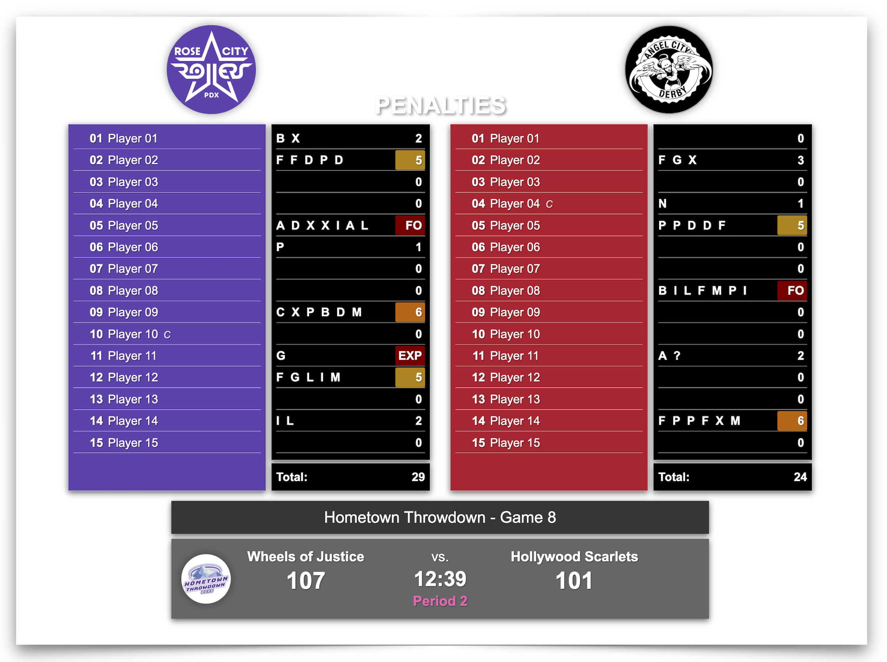

# Penalties Overlay

## Contents

- [Features](#features "Overlay Features")
- [Compatibility](#compatibility "Overlay CRG Compatibility")
- [Usage](#usage "Overlay Usage Instructions")

## Preview

## Overview

Video streaming teams often display an overlay with penalty data during timeouts, although it isn't always easy for viewers to understand what all of the data means.  This is especially true when a penalty overlay might only be visible for a few seconds.  The intent of this overlay is to provide a simple view of penalty and game status information in a format that makes it easy to see:

- Which teams are playing each other.
- The score, period number, game clock.
- Which team is on which side of the screen.
- Which players have penalties, and how many they have.
- Which players have high penalty counts, have fouled out, or have been expelled.
- How many penalties each team has.
- Tournament information, if applicable.
- The status of any active timeout.
- Optionally, the host league, tournament, or sanctioning body logo.

## Features

The overlay gets the information and settings it needs from CRG, so you can just set up your game(s) and expect the overlay to work.  The overlay displays information from CRG in two separate areas: one for rosters and penalties, and one for game information.

### Rosters & Penalties Area

- Displays team logos, if logos are configured for *both* teams.
  - Logos automatically resize to fit 180 x 180px containers.
- Displays rosters for each team that include player numbers, names, assigned penalty codes, and total penalty count for each player.
  - Indicates team captains with a "C" and alternate captains with an "A".
  - Hides roster names that:
    - Are marked as "Not Skating", "Bench Alt Captain", or "Bench Staff".
    - Don't include a roster name *and* number.
  - Uses each team's custom "whiteboard" background, text, and glow colors if set.
    - Defaults to black backgrounds with white text black shadows if not set.
- Highlights player penalty counts with different color backgrounds at specific thresholds.
  - 5 penalties in yellow :yellow_square:
  - 6 penalties in orange :orange_square:
  - 7+ penalties, foul outs, and expulsions in red :red_square:
- Changes player numeric penalty counts to "FO" or "EXP" for foul outs and expulsions, respectively.
  - Displays "EXP" for players who are expelled and foul out.
- Displays the total penalty count for each team.

### Game Information Area

- Displays the tournament name if set.
  - Displays the game number if it and the tournament name are set.
- Displays team names if set.
  - Uses the "whiteboard" alternate name text for each team if set.
  - Uses the "Team" fields in the "Teams" tab for a game if the "whiteboard" name is not set.
  - Defaults to "Team 1" and "Team 2" if neither the "whiteboard" nor "Team" names are set.
- Displays each team's score.
- Displays the game clock.
- Displays a game status label:
  - Uses the appropriate label set by clicking the "Intermission Labels" button section on CRG's "Settings" page:
    - **Pre Game** - defaults to "Time to Derby".
    - **Intermission** - defaults to "Intermission".
    - **Unofficial Score** - defaults to "Unofficial Score".
    - **Official Score** - defaults to "Official Score".
    - **Official Score with Clock** - defaults to "Official Score".
  - Uses default game clock labels for other game statuses:
    - "Period N" - during each period.
    - "Overtime" - during overtime jams.
- Optionally displays a custom logo to provide league, tournament, or sanctioning body branding.
  - Automatically resized to fit a 100 x 100px container.

## Compatibility

| CRG Version | Description        |
| ----------- | -------------------|
| 2025.x      | :white_check_mark: |
| 2023.x      | Not Tested         |
| Other       | :x:                |

## Usage

To make this overlay available to your video streaming team, you need to download the overlay files from this repository and place them in a specific folder within your instance of CRG.  There are several ways to download the overlay files, and the following steps detail one method.

**Download the overlay files:**

1. Navigate to the [Releases page](https://github.com/rcrderby/crg-overlays/releases "Releases Page") of this repository.
2. Click on one of the **Source code** links in the **Assets** section of the latest release to download a compressed/zipped copy of the overlay files.
3. Extract the `.zip` or `tar.gz` file you downloaded.
4. From the extracted files, locate the `penalties`folder; you will copy this folder to your instance of CRG.

**Copy the overlay files to CRG:**

1. Open the folder on your scoreboard computer that contains your instance of CRG (e.g., `crg-scoreboard_v202N.x`).
2. Open the `html` folder.
3. Open the `custom` folder.
4. Open the `overlay` folder.
5. Copy and paste or move the `penalties` folder you downloaded into the `overlay` folder.

**Verify the availability of the penalties overlay:**

1. Access your running instance of CRG using your web browser (`https://<crg-ip-address>:8000`).[^1]
2. In the **BROADCAST OVERLAYS** section on the left side of the main page, click the **Custom Overlays** link.
3. From the displayed list of files and directories, click the **penalties** link to display the overlay.

### Open Broadcaster Software (OBS) Details

Provide this information to your video streaming team to give them access to the overlay:

| Setting    | Value                                                    |
| ---------- | -------------------------------------------------------- |
| Resolution | 1920 x 1080                                              |
| Background | Transparent                                              |
| URL        | `https://<crg-ip-address>:8000/custom/overlay/penalties` |

### Optional Custom Logo

To add a custom logo to the left side game information area of the overlay:

1. Create a logo file with the name `banner-logo.png`.[^2]
2. Open the folder on your scoreboard computer that contains your instance of CRG (e.g., `crg-scoreboard_v202N.x`).
3. Open the `html` folder.
4. Open the `custom` folder.
5. Open the `overlay` folder.
6. Open the `logos` folder.
7. Copy and paste or move the `banner-logo.png` file into the `logos` folder.

The logo will display in the game information area of the overlay once you refresh your browser.

<!-- Footnotes -->

[^1]: Replace `<crg-ip-address>` with the IP address of your CRG instance.
[^2]: The overlay will constrain your logo to a 100 x 100px container and apply a drop shadow.  
Logos with a 1:1 aspect ratio and a transparent background will produce the best appearance.
